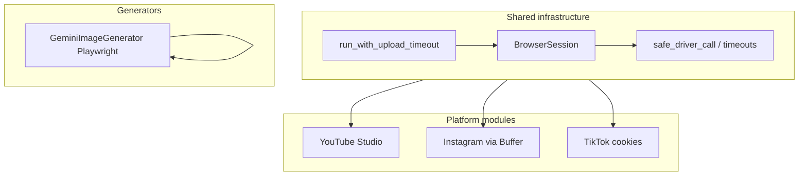

# Content Automation Core

[](https://www.python.org/downloads/)
[](LICENSE)

A Python toolkit for **browser-based content workflows**: a hardened Selenium layer for long-running uploads, platform-specific upload pipelines (YouTube Studio, TikTok, Instagram via Buffer), and optional Gemini image generation through Playwright.

Designed for **reliability under production-style constraints**—bounded timeouts, deterministic teardown, and safe process cleanup—rather than brittle “happy path” scripts.

---

## Why this exists (resume-friendly highlights)

- **Industrial browser session layer** (`uploaders/_browser.py`): thread-bounded WebDriver calls, global per-upload wall-clock caps, normalized path matching for Chrome/`chromedriver` teardown (avoids killing unrelated browser profiles), overlay dismissal without fragile single-site CSS hacks, and crash/hang detection (`is_healthy`, `is_page_healthy`).
- **Multi-platform upload automation** with explicit failure modes (e.g. YouTube channel appeal / login redirects, TikTok cookie/session expiry, Buffer login detection).
- **Separation of concerns**: shared infrastructure vs. per-platform DOM logic, functional one-shot APIs preserved for callers.

---

## Architecture



---

## Features

| Area | Details |
|------|---------|
| **Timeouts** | Command-level, navigation, and whole-upload caps (`GLOBAL_UPLOAD_TIMEOUT`, etc.). |
| **Cleanup** | `force_close()` tears down driver and matching Chrome PIDs within a hard deadline; singleton lock cleanup for persistent profiles. |
| **UI friction** | Generic blocking-overlay detection (coverage + z-index), plus hint-based dismissal for common tour overlays. |
| **Observability** | Runtime counters (`get_runtime_counters`), structured logging hooks. |

---

## Requirements

- **Python** ≥ 3.10  
- **Google Chrome** installed (Selenium uses Chrome; Gemini generator uses Playwright’s Chrome channel).  
- **ChromeDriver**: compatible with your Chrome version (Selenium 4 resolves this automatically in typical setups).

Install Playwright browsers when using the Gemini module:

```bash
playwright install chromium
```

---

## Installation

From the repository root:

```bash
pip install -e .
```

Or install dependencies only:

```bash
pip install selenium playwright psutil
```

---

## Usage (overview)

### YouTube Studio (persistent Chrome profile)

Login state is expected in the given profile directory (you authenticate manually once or reuse an existing profile).

```python
from content_automation_core.uploaders import upload_video_to_youtube

upload_video_to_youtube(
    video_path="/path/to/video.mp4",
    title="My title",
    description="My description",
    profile_path="/path/to/chrome_profile",
    headless=False,
    visibility="public",
)
```

### TikTok (Netscape cookie file)

```python
from content_automation_core.uploaders import upload_video_to_tiktok

upload_video_to_tiktok(
    video_path="/path/to/video.mp4",
    description="Caption text",
    cookies_file="/path/to/cookies.txt",
    headless=False,
)
```

### Instagram Reels via Buffer

Requires your Buffer composer URL and a Chrome profile logged into Buffer.

```python
from content_automation_core.uploaders import upload_instagram_reels

upload_instagram_reels(
    file_path="/path/to/reel.mp4",
    caption="Caption",
    profile_path="/path/to/chrome_profile",
    buffer_url="https://publish.buffer.com/...",
)
```

### Gemini image generation (Playwright)

Uses a persistent Chrome profile and your Gemini URL (session/login is your responsibility).

```python
from content_automation_core.generators import generate_gemini_image

path = generate_gemini_image(
    prompt_text="A minimal product photo on white background",
    download_dir="/path/to/downloads",
    chrome_profile="/path/to/playwright_profile",
    gemini_url="https://gemini.google.com/app/...",
)
```

---

## Project layout

```
content_automation_core/
├── uploaders/
│   ├── _browser.py      # BrowserSession, timeouts, overlay handling
│   ├── youtube.py       # YouTube Studio upload flow
│   ├── instagram.py     # Buffer → Instagram Reels
│   └── tiktok.py        # TikTok upload via cookies
└── generators/
    └── gemini.py        # Gemini image generation (Playwright)
```

---

## Legal & ethics

Automating third-party websites may violate **terms of service** or **acceptable use policies**. This repository is shared for **education and engineering transparency**. You are solely responsible for compliance with applicable laws and platform rules. Do not use this software for spam, deception, or unauthorized access.

---

## License

[MIT](LICENSE)

---

## نسخه فارسی (خلاصه)

این پکیج یک لایهٔ مشترک برای **اتوماسیون مرورگر** (Selenium + در بخش تصویر Playwright) است با تمرکز روی **پایداری در اجرای طولانی**: محدودیت زمانی برای دستورات، بستن امن مرورگر، و ماژول‌های جدا برای آپلود به **یوتیوب**، **تیک‌تاک** (کوکی)، و **اینستاگرام از مسیر Buffer**. برای رزومه، روی معماری جدا شدن «زیرساخت مرورگر» از «منطق هر پلتفرم» و بحث تایم‌اوت/پاکسازی فرآیند تأکید کنید. ریپوی عمومی جدا را می‌توانید با محتوای همین پوشه بسازید و این README را به‌عنوان توضیح پروژه لینک دهید.
